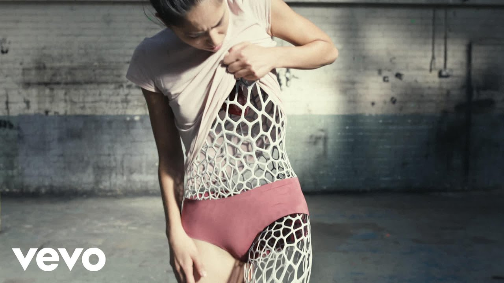

# Wide-open FX

Real-time human detection with a visual effect (glowing **skeleton** or white **face mesh**),
running in the browser from a webcam. Built for an installation: camera in a room,
output fullscreen on a screen.

Stack: plain HTML/JS + [`@mediapipe/tasks-vision`](https://www.npmjs.com/package/@mediapipe/tasks-vision)
(Pose Landmarker + Face Landmarker). No build step, no framework.

**Inspiration:** The Chemical Brothers — *Wide Open* (ft. Beck). The music-video look —
a dancer traced in a white 3D-printed Voronoi shell — is the visual north star:



---

## Try it live

**https://pmitrifork.github.io/wide_opener/** — open on a phone (Safari/Chrome),
allow the camera, tap once to enable sound.


---

## Run it (Windows, built-in webcam)

You need a local web server — opening `index.html` as a `file://` will **not** work
(the camera and ES modules require an `http://localhost` origin).

```powershell
cd human-fx-demo
python serve.py
```

Then open **http://localhost:8000** and allow camera access. That's it.

> No Python? `npx serve` or any static server works too — just keep the origin on `localhost`.

The library and ML models stream from a CDN on first load (needs internet **once**,
then the browser caches them). For a fully offline installation, see *Offline* below.

---

## Controls (keyboard)

| Key | Action |
|-----|--------|
| `E` | cycle effect (see the list below) |
| `B` | background: live video → black → custom image |
| `M` | mirror (selfie flip) |
| `C` | flip front / back camera |
| `F` | fullscreen |
| `H` | hide / show the HUD |

The HUD bottom-left shows the active effect and live FPS. When nobody is in frame
for ~1s, a **STEP INTO FRAME** idle prompt fades in.

On phones/tablets, on-screen buttons appear instead: **FX** (effect), **BG**
(background), **⇄** (mirror), **📷** (flip front/back camera), **⛶** (fullscreen),
**HUD**.

---

## Effects — cycle with `E`

| Effect | What it does |
|--------|--------------|
| **SKELETON** | Glowing neon skeletons — draws **every** detected person, each in its own colour. Best at a distance. |
| **FACE MESH** | Classic dense white face mesh with accented eyes/lips. |
| **FULL BODY** | Body skeleton + face mesh together. |
| **BODY MESH** | The *Wide Open* look — an organic Voronoi "3D-printed shell" mapped onto your whole body silhouette, with a boundary outline. Plays a clip on entry. |
| **AFRO** | A big procedural afro anchored to your head. Plays a clip on entry. |
| **DEVIL** | Devil horns on your head. Plays a clip on entry. |
| **HALO** | A glowing golden halo floating above your head. Plays a clip on entry. |
| **COWBOY** | A cowboy hat on your head. Plays a clip on entry — and **arms the gun gestures**. |

Tip: switch the background to **black** (`B`) to make the glowing effects pop; in
the head-overlay effects your face still shows through.

## Gestures — try these with your hands ✋

Some work anywhere; others only in a specific effect.

| Gesture | Result | Where |
|---------|--------|-------|
| 👍 **One thumb up** | a *ding* | any effect |
| 👍👍 **Two thumbs up** | applause | any effect |
| 👎 **Thumb down** | boo | any effect |
| 👉 **Finger gun** (point) | gunshot + muzzle flash | **COWBOY** only |
| ✌️ **Two-finger gun** (index + middle) | bigger gunshot | **COWBOY** only |
| 👉👉 **Both hands as guns** | machine-gun | **COWBOY** only |
| 🖕 **Middle finger** | thunder | **DEVIL** only |
| 🫰 **Two-hand heart** | floating hearts | **HALO** only |

Hold a gesture briefly for it to register (a short stability delay prevents
accidental triggers). Sound needs one tap on the page first (mobile autoplay).

---

## Tuning — everything lives in `src/config.js`

- **Performance**: drop `camera.width/height` to `640 / 480` for a big FPS boost.
  Keep `delegate: "GPU"`; switch to `"CPU"` only if the GPU path misbehaves.
- **One person**: `numPoses` / `numFaces` are set to `1` — only the most prominent
  subject is rendered, even in a crowd.
- **Default look**: `startEffect`, `showVideo` (effect-on-black is the moodier
  installation look), and `mirror`.

> For a walk-around space at a **distance**, the **skeleton** is the more reliable
> default — the face mesh needs faces fairly close and well-lit.

---

## Offline / unattended installation

Vendor the library + models locally so there's no CDN dependency at showtime.
On a machine with internet, run once:

```powershell
powershell -ExecutionPolicy Bypass -File .\download-assets.ps1   # Windows
# or:  bash download-assets.sh                                    # macOS/Linux
```

Then set `source: "local"` in `src/config.js`. Everything now loads from `./vendor`.

---

## Deploy online (GitHub Pages)

The camera needs a **secure context (HTTPS)**, so it won't work served over plain
`http://`. The easiest free host is GitHub Pages — no build step, HTTPS included,
and because `source: "cdn"` pulls MediaPipe from jsDelivr, the host never has to
serve the tricky `.mjs` / `.wasm` MIME types. All asset paths are relative, so it
works fine from a `/<repo>/` subpath.

1. Push to GitHub (already done if you're reading this in the repo).
2. Repo **Settings → Pages → Build and deployment**:
   - **Source**: Deploy from a branch
   - **Branch**: `main`, folder **/(root)** → **Save**
3. Wait ~1 min. Live at `https://<user>.github.io/<repo>/`
   (e.g. https://pmitrifork.github.io/wide_opener/).

Every push to `main` redeploys automatically. First load on a new device pulls the
ML models from the CDN (~10 MB), so give it a few seconds.

**iPhone / mobile notes**
- Open the HTTPS URL in Safari and allow the camera.
- Tap the screen once — that first tap unlocks audio (iOS blocks sound until a
  user gesture). Make sure the side **mute switch** is off.
- Use the on-screen buttons (they appear on touch devices) instead of the keyboard.

Other one-click options: **Cloudflare Pages** / **Netlify** / **Vercel** — connect
the repo, leave the build command empty, set the publish directory to the repo root.

### Quick local HTTPS for testing on a phone

To test the live machine on a phone before deploying, tunnel the local server:

```powershell
python serve.py                       # serves http://localhost:8000
# in another terminal:
cloudflared tunnel --url http://localhost:8000   # prints an https://*.trycloudflare.com URL
# or:  ngrok http 8000
```

Open the printed HTTPS URL on the phone.

---

## Project layout

```
human-fx-demo/
├── index.html            # entry: video + canvas stage + HUD
├── serve.py              # local static server (correct MIME types)
├── download-assets.*     # optional: vendor libs/models for offline
├── vendor/               # populated by download-assets
└── src/
    ├── config.js         # ← the knobs you'll actually touch
    ├── main.js           # camera + MediaPipe + render loop
    ├── effects.js        # skeleton & mesh drawing (add new effects here)
    └── style.css         # dark motion-capture look
```

## Adding a new effect

Write a `draw(ctx, drawingUtils, result, deps)` function in `effects.js`, then add it
to the `EFFECTS` registry with the detector it needs (`"pose"` or `"face"`).
It joins the `E`-key rotation automatically.

---

## Where this sits in the 12h plan

- **Phase 0–2 (setup, detection, skeleton):** ✅ done — this scaffold runs and shows
  the skeleton effect out of the box.
- **Phase 3 (white mesh):** ✅ included as the second effect.
- **Phase 4 (perf & polish):** start from `config.js` (resolution), the idle state and
  effect-on-black are already wired.
- **Phase 5 (demo hardening):** test on the real machine/lighting; vendor assets offline;
  keep a recorded clip as a fallback.

Possible next steps: full-body white mesh via a segmentation mask, smoothing/interpolation
between frames, or a particle/trail effect off the joint positions.
